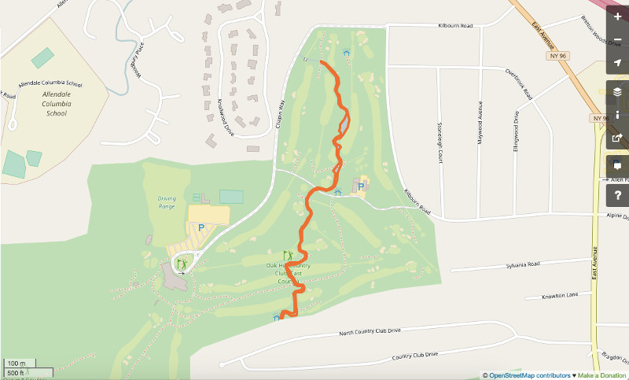

# OpenStreetMap Project 

The objective of this OpenStreetMap (OSM) project is to audit and clean OSM data from the Greater Rochester, NY, area.  This region is of particular interest because it is where I was born and where I lived for the first eighteen years of my life. The raw data was downloaded from OSM via Mapzen and was saved as 'Rochester.osm' (see the Mapzen link [here](https://mapzen.com/data/metro-extracts/your-extracts/a299d201ae3b)). The size of the file was 53.6 MB. (A smaller sample of the Rochester.osm file, ~5 MB, is located in Rochester_sample.osm.) The data was processed and interrogated with a series of four scripts, summarized below:

* **audit_tags.py**: Summarize and categorize the data in 'tag' elements in the OSM file. Audit tags that contain (i) problematic characters, (ii) street addresses, and (iii) zip codes
* **osm_to_csv.py**: Clean the OSM data and transfer to .csv files
* **csv_to_database.py**: Define the schema for a SQL database and upload the data from the previously created .csv files
* **sql_queries**: Extract information from the database with SQL queries

Additionally, the schema.py script implemented in the Udacity lessons is included for the validation step in the osm_to_csv.py script. Resources that were utilized to develop the code in the python scripts are referenced in the code file headers.

---

## Section 1: Problems encountered in the map

### 1a: Cursory audit of 'tag' elements

To develop a rough sense of the data contained in the 'tag' elements of nodes, ways, and relations in the OSM file, the audit_tags.py script was run to summarize the contents of the 'tag' elements. In total, the OSM file contained 154,102 tag elements. In these elements, 446 _unique_ keys were present. After performing a cursory scan of the unique keys by eye, at least three large clusters were evident: (i) tags with 'tiger' data, (ii) tags with 'gnis' data, and (iii) tags labeled with 'fixme'. A fourth category was investigated, namely those tags that had keys with problematic characters as defined in one of the Udacity lessons (_Case study: OpenStreetMap data [SQL] / Quiz: Tag types_). All other keys were classified as 'other'. The tag elements were segmented into the five categories and counted programmatically, yielding the results in Table 1:

|Category |Number of keys          |Fraction of total|
|:--------|:----------------------:|----------------:|
|tiger    |61901                   |0.402            |
|gnis     |1873                    |0.012            |
|fixme    |36                      |0.000            |
|probem   |1                       |0.000            |
|other    |90291                   |0.586            |
|**TOTAL**|154102                  |1.000            |

  <b>Table 1: Key categories from Rochester.osm</b>

Forty percent of the tag data is from the United States Census Bureau's Topologically Integrated Geographic Encoding and Referencing (TIGER) system. According to OSM's wiki regarding [TIGER fixup] [1], a number of issues may be encountered with TIGER data. Since the TIGER database was created for the purpose of guiding census surveys, many of the issues deal with the accuracy of nodes representing roads and boundaries. Also, since the data was uploaded in 2007/2008, some of the data is antiquated. 

The next largest cluster of data, composing about 1% of the data, is from the United States Geographical Survey's Geographic Names Information System (GNIS). According to OSM's wiki regarding [USGS GNIS] [2], this data was also bulk imported like TIGER data, and hence contains a number of errors. Many of those errors relate to features that no longer exist. 

While issues with geographic location accuracy and outdated-ness are beyond the scope of this project, three problems were identified that could be addressed programmatically. They were: (1) keys with problematic characters, (2) overabbreviation of street names, and (3) incorrect zip codes.

### 1b: Keys with problematic characters

To identify keys that contain problematic characters (characters other than alphanumeric and underscore), a regex was run against a dictionary of all the keys aggregated from the OSM file. Only one key was identified with problemmatic characters - 'Hours of Operation' - which contains spaces. During the upload of the OSM data to .csv files (with the osm_to_csv.py script), the spaces were replaced with underscores with a call to the following function:

~~~~ python
def fix_prob_chars(key):
    '''Eliminate problematic characters from keys'''
    
    if ' ' in key:
        new_key = list(key)
        for i, char in enumerate(new_key):
            if char == ' ':
                new_key[i] = '_'
    new_key = ''.join(new_key)
    return new_key
~~~~

### 1c: Overabbrevation of street names

A larger issue was found with abbreviations in street names. First, a section of the auidit_tags.py script was run to compile all the tags with address-related fields. From that compilation, keys named 'addr:street' were identified as the most relevant. A second process was run to capture the last word at the end of street name strings, similar to the approach in the Udacity lesson _Case study: OpenStreetMap data [SQL] / Auditing Street Names_. After going through the collection of possible abbreviations manually, a mapping dictionary was developed to correlate abbrevations with their full form. During the upload of the OSM data to .csv files with osm_to_csv.py, the street names strings were interrogated for abbreviations, and the abbreviations were expanded:

~~~~ python
def fix_street_abbrevs(street):
    '''Expand abbreviations in street names'''
    
    mapping = {
        'ave': 'Avenue',
        'Ave': 'Avenue',
        # ...
        # See code for complete mapping dict
    }
    
    elements = street.split()
    for i in range(len(elements)):
        if elements[i] in mapping:
            elements[i] = mapping[elements[i]]
    updated_street = ' '.join(elements)
    return updated_street
~~~~

### 1d: Incorrect zip codes

Finally, the OSM file was audited for correct zip codes. The audit_tags.py script compiled the values of tags with the key 'addr:postcode'. Only two instances were problematic - one with the value '1--', and a second with the value 'West Main Street'. During the conversion to .csv files, both of these zip codes were converted to 'fixme':

~~~~ python
def fix_zipcode(zipcode):
    '''Check the zipcode for the proper format'''
    
    zipformat = re.compile(r"(^[0-9]{5})(-[0-9]{4})?")
    if zipformat.match(zipcode):
        return zipcode
    else:
        return 'fixme'
~~~~

---

## Section 2: Overview of the data

After loading the partially-cleaned data to a database with csv_to_database.py, a number of summary statistics were compiled with the sql_queries.py script.  

### 2a: Total number of unique users
Borrowing a query from carlward's [sample_project.md] [3] file on github, 23 unique contributors were identified in the Rochester.osm file: 

~~~~ python
query = '''SELECT COUNT(DISTINCT(subquery.uid))
           FROM
               (SELECT uid FROM nodes
                UNION ALL
                SELECT uid FROM ways)
           AS subquery;'''
~~~~

### 2b: List of unique users contributing to nodes
A total of 20 unique users contributed to the nodes table, the most prolific being TomHynes with 1,090 contributions:

~~~~ python
query = '''SELECT user, COUNT(*) AS num
           FROM nodes
           GROUP BY user
           ORDER BY num DESC;'''
~~~~

### 2c: List of unique users contributng to ways
Only 14 unique users contributed to the ways table. Again TomHynes contributed the most entries with a total of 153:

~~~~ python
query = '''SELECT user, COUNT(*) AS num
           FROM ways
           GROUP BY user
           ORDER BY num DESC;'''
~~~~

From a search on LinkedIn ([link] [4]), it appears Tom Hynes is a professional GIS programmer/analyst from New York.

### 2d: Number of nodes
In total, the database contains 4,283 nodes:

~~~~ python
query = '''SELECT COUNT(*)
		   FROM nodes;'''
~~~~

### 2e: Number of ways
The database contains 378 ways:

~~~~ python
query = '''SELECT COUNT(*)
		   FROM ways;'''
~~~~

### 2f: Number of restaurants
Surprisingly, no nodes and only one way were tagged with 'restaurant', reflecting a large deficiency in the data:

~~~~ python
query = '''SELECT COUNT(*)
               FROM nodes_tags
               WHERE value LIKE "%restaurant%"
               GROUP BY id
               ;'''
               
query = '''SELECT COUNT(*)
               FROM ways_tags
               WHERE value LIKE "%restaurant%"
               GROUP BY id
               ;'''
~~~~

### 2e: Number of schools
Also, only 2 nodes and 1 way were tagged as schools, suggesting that the number of properly labeled buildings in the Rochester.osm file could be expanded significantly:

~~~~ python
query = '''SELECT COUNT(*)
               FROM nodes_tags
               WHERE value LIKE "%school%"
               GROUP BY id;'''
               
query = '''SELECT COUNT(*)
               FROM ways_tags
               WHERE value LIKE "%school%"
               GROUP BY id;'''
~~~~

### 2f: Number of nodes in ways
A number of interesting observations were made by looking at the number of nodes that were associated with each way. To calculate the average number of nodes per way, the following query was executed:  
~~~~ python

query = '''SELECT AVG(num)
               FROM
                   (SELECT COUNT(node_id) AS num
                    FROM ways_nodes
                    GROUP BY id)
               AS subquery;'''
~~~~

Then, to look at the distribution of nodes per way, another query was run:

~~~~ python
query = '''SELECT COUNT(node_id) AS num
			   FROM ways_nodes
			   GROUP BY id
			   ORDER BY num DESC;'''
~~~~

After, the data was displayed as a histogram in Figure 1 using matplotlib:  

<b>Figure 1: Histogram of the distrubution of the number of nodes per way in Rochester.osm</b>

  

Immediately, one can see that the distribution is highly right-skewed. The average of 12 nodes per way, but the mode is 4 - leading to a hypothesis that most of the data represents simple man-made structures, and quadrilaterals are the simplest way of representing these structures. The entire lower end of the distribution shows a high preference for an even number of nodes to be associated with a way, again suggesting a propensity for box-shaped artificial structures in the map data. Ways that had a higher number of nodes per way tended to be 'natural' features. For instance, a query was executed to extract the ways with the top number of nodes:

~~~~ python
query = '''SELECT subquery.id, num, key, value, type
			   FROM 
				   (SELECT id, COUNT(node_id) AS num
					FROM ways_nodes
					GROUP BY id
					ORDER BY num DESC
					LIMIT 20) AS subquery
			   JOIN ways_tags
			   ON subquery.id=ways_tags.id
			   ORDER BY num DESC
			   LIMIT 10;'''
~~~~

The two ways with the highest number of nodes are the east (Figure 2) and west (Figure 3) borders of Irondequoit Bay:

  

<b>Figure 2: Render of way #157188681, the western coast of Irondequoit Bay (Credit: OpenStreetMap)</b>

 

  

<b>Figure 2: Render of way #313476845, the eastern coast of Irondequoit Bay (Credit: OpenStreetMap)</b>

 

The way with the third highest number of nodes is a footpath on the eastern shore of Irondequoit Bay (Figure 4), which coindidentally happens to be at the end of the street I grew up on - Smith Road.

  

<b>Figure 4: Render of way #430128611, a path on the eastern side of Irondequoit Bay (Credit: OpenStreetMap)</b>

 

---

## Section 3: Other ideas about the dataset

One of the largest issues with the data set was simply lack of data, _e.g._, only one restaurant being present, whereas the US Census Bureau documented close to 600 in 2012 ([link] [5]). One idea to increase the amount of data would be to set up an 'augmented' reality app that would identify structures that are not present in the OSM database, and offer incentives for scanning in their GPS data. One issue with this approach, however, could be the accuracy with the users' GPS hardware, which would likely be inferior to dedicated GPS systems. Also, incentivizing user activity could be problematic. Perhaps OSM data collection could be combined with some kind of exercise app with rewards for meeting certain movement goals.
 
 
[1]: http://wiki.openstreetmap.org/wiki/TIGER_fixup "http://wiki.openstreetmap.org/wiki/TIGER_fixup"
[2]: http://wiki.openstreetmap.org/wiki/USGS_GNIS "http://wiki.openstreetmap.org/wiki/USGS_GNIS"
[3]: https://gist.github.com/carlward/54ec1c91b62a5f911c42#file-sample_project-md
[4]: https://www.linkedin.com/in/thomas-hynes-7ab13049/
[5]: https://factfinder.census.gov/faces/tableservices/jsf/pages/productview.xhtml?src=CF
 
